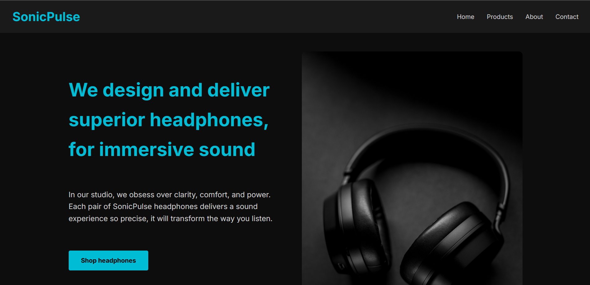
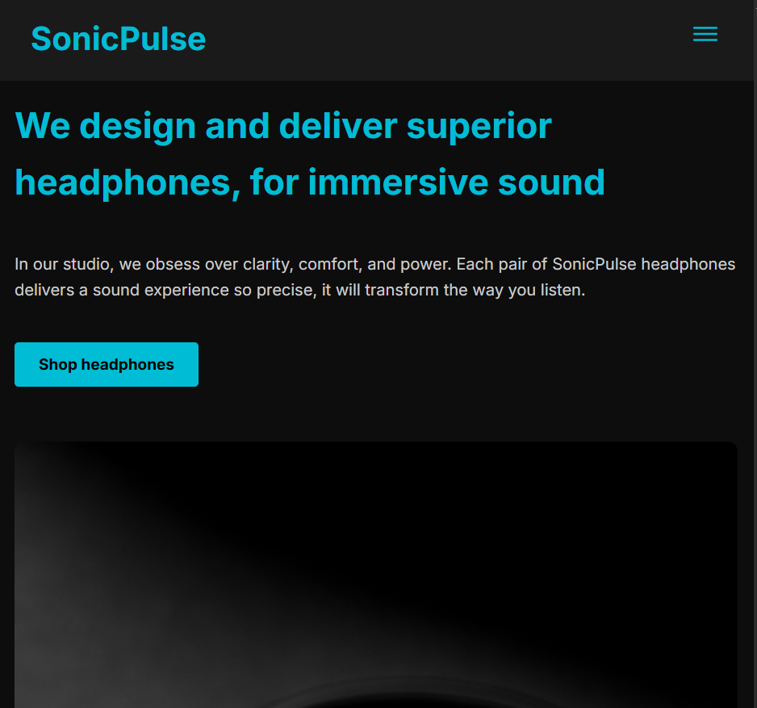
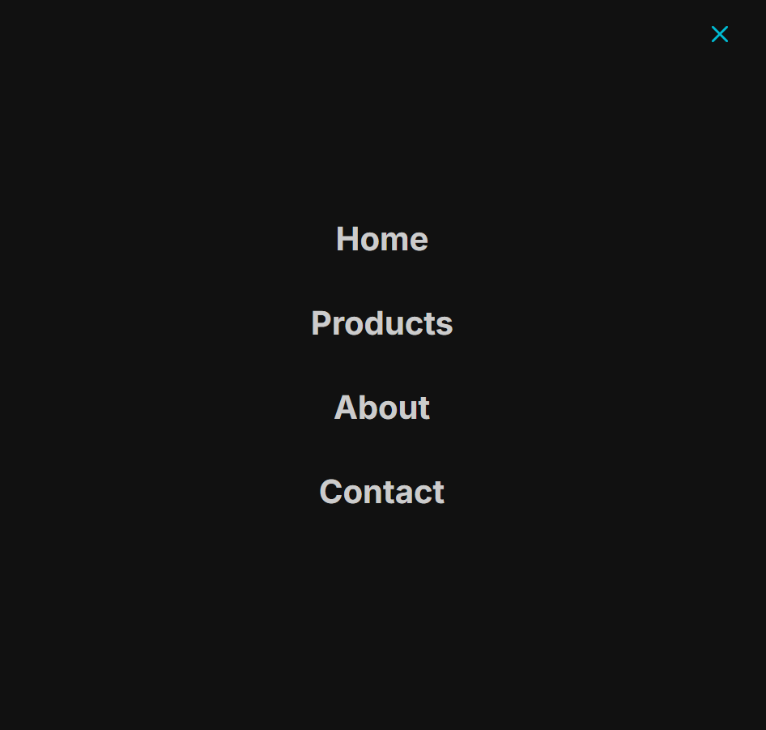

# 🎧 SonicPulse | Premium Headphones

A sleek and responsive landing page for **SonicPulse**, a fictional premium headphone brand.  
Crafted using **HTML, CSS & JavaScript**, this project showcases clean layout, product highlights, testimonial section, and engaging visuals — all wrapped in a modern dark theme.

---

## 🎨 Features

- 📱 Responsive design optimized for desktop and mobile
- 🍔 Slide-in navigation with dark overlay for mobile
- ✖️ Toggle hamburger ↔ cross icon
- 🔗 Active link highlighting on nav items
- 🔊 Highlight section showcasing key headphone features
- 🧠 Informative testimonial section with real-world appeal
- 🛍️ Product cards with call-to-action buttons
- 🌑 Clean dark UI for immersive premium feel
- 💡 Simple navigation bar with smooth hover effects

---

## 🛠️ Built With

| Technology    | Purpose           |
| ------------- | ----------------- |
| 🧱 HTML5      | Page structure    |
| 🎨 CSS3       | Styling & layout  |
| ✨ JavaScript | Mobile navigation |

---

## 📸 Screenshot

---

## 🌐 Live Demo

🔗 **GitHub Pages:**

---

## 📧 Let's Connect 🎧

🔗 **LinkedIn:**  
[https://www.linkedin.com/in/gaurav-lad1974](https://www.linkedin.com/in/gaurav-lad1974)

📨 **Email:**  
gauravlad1974@gmail.com
